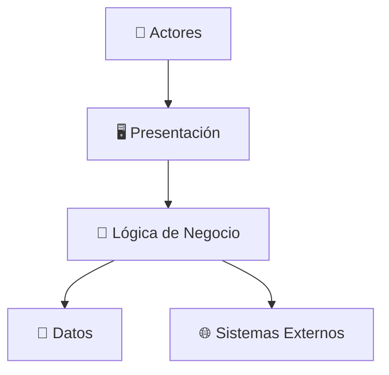

<div align="center">

<!-- Banner superior con badges -->


<br/>

<!-- Título principal grande -->
# 🐾 MARKETPLACE DE PRODUCTOS PARA MASCOTAS 🐶

### 🎓 Proyecto Académico — Arquitectura de Software


<br/>
<br/>

<!-- Descripción destacada -->
> 🛒 **Marketplace académico de productos para mascotas**  
> Plataforma que permite a **compradores** explorar y adquirir productos, y a **vendedores** publicar y gestionar su inventario, con funcionalidades de carrito, pagos, envíos y notificaciones.

</div>

---

## 📌 Tabla de contenidos

- [👤 Autor](#-autor)
- [📖 Descripción](#-descripción)
- [🎯 Caso de estudio](#-caso-de-estudio)
- [🏗️ Arquitectura](#️-arquitectura)
- [📂 Estructura del repositorio](#-estructura-del-repositorio)
- [🛠️ Tecnologías y herramientas](#️-tecnologías-y-herramientas)
- [📚 Curso](#-curso)

---

## 👤 Autor

<table>
  <tr>
    <td align="center">
      <br/>
      <b>Jordy Julian Huaman Lozano</b><br/>
      <sub>Estudiante de Arquitectura de Software</sub>
    </td>
  </tr>
</table>

---

## 📖 Descripción

<div align="center">

| 🧩 Elemento | 📝 Detalle |
|:-----------:|:-----------|
| 🎯 **Objetivo** | Marketplace académico de productos para mascotas |
| 🛍️ **Compradores** | Explorar, consultar y adquirir productos |
| 🏪 **Vendedores** | Publicar y gestionar inventario |
| ⚙️ **Funcionalidades** | Carrito, pagos, envíos y notificaciones |

</div>

El sistema permitirá a **compradores** explorar y adquirir productos, y a **vendedores** publicar y gestionar su inventario, con funcionalidades de carrito, pagos, envíos y notificaciones.

---

## 🎯 Caso de estudio

<div align="center">

### 🐕 GoPet como referencia funcional


</div>

> GoPet es una plataforma de comercio electrónico de productos para mascotas que sirve como **referente funcional** para el diseño y análisis de este marketplace académico.

---

## 🏗️ Arquitectura

<div align="center">

### ⚡ Arquitectura en Capas



</div>

📎 Ver detalle completo en [`arquitectura/arquitectura-inicial.md`](arquitectura/arquitectura-inicial.md)

---

## 📂 Estructura del repositorio

```
📦 Marketplace-arquitSoft-02-Jordy-Julian-Huaman-Lozano
 ┣ 📂 analisis-de-sistema
 ┃ ┣ 📄 01-actores.md
 ┃ ┣ 📄 02-historias-de-usuario.md
 ┃ ┣ 📄 03-requisitos-funcionales.md
 ┃ ┣ 📄 04-atributos-de-calidad.md
 ┃ ┣ 📄 05-restricciones.md
 ┃ ┗ 📄 06-driver-arquitectonicos.md
 ┣ 📂 arquitectura
 ┃ ┗ 📄 arquitectura-inicial.md
 ┣ 📂 capturas
 ┃ ┗ 🖼️ cap-2.png
 ┣ 📄 .gitignore
 ┗ 📄 README.md
```

---

## 🛠️ Tecnologías y herramientas

<div align="center">

| 🧰 Herramienta | 🎯 Uso |
|:--------------:|:-------|
|  | Redacción en Markdown |
|  | Control de versiones |
|  | Repositorio remoto |
|  | Diagramas gráficos |
|  | Diagramas como texto |

</div>

---

## 📚 Curso

<div align="center">

### 🎓 Arquitectura de Software


</div>

---

<div align="center">

### ⭐ ¡Gracias por visitar este repositorio! ⭐


</div>
