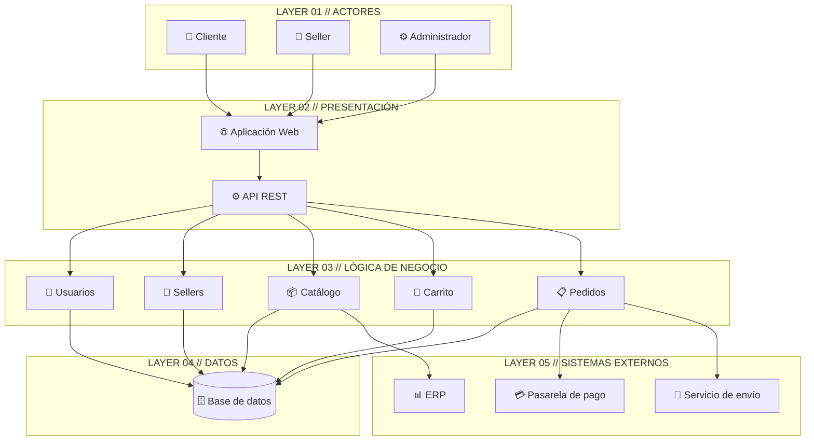

# Arquitectura Inicial

## Ejercicio 09: Diseñar la arquitectura en capas

### Objetivo
Organizar los módulos identificados anteriormente dentro de una primera propuesta de arquitectura, utilizando una **arquitectura de tres capas**.

---

## Preguntas que responde cada capa

| Capa | Pregunta que responde |
|------|-----------------------|
| Presentación | ¿Cómo interactúa el usuario? |
| Lógica de negocio | ¿Qué hace el sistema? |
| Datos | ¿Dónde se almacena la información? |

---

## Responsabilidades por capa

### 1. Capa de Presentación
- Mostrar la interfaz web al cliente, seller y administrador.
- Exponer la **API REST** consumida por el frontend.
- Gestionar la autenticación inicial y el enrutamiento de las solicitudes.
- Validar datos de entrada antes de enviarlos a la capa de negocio.

### 2. Capa de Lógica de Negocio
- Implementar las reglas del marketplace.
- Coordinar los módulos de **Usuarios, Sellers, Catálogo, Carrito y Pedidos**.
- Orquestar la comunicación con sistemas externos (pago, envío, facturación, ERP).
- Aplicar validaciones de negocio y control de permisos.

### 3. Capa de Datos
- Almacenar y recuperar la información del sistema.
- Gestionar la persistencia de usuarios, productos, pedidos y sellers.
- Proveer acceso a la base de datos a través de repositorios.

---

## Módulos por capa

| Capa | Módulos |
|------|---------|
| Presentación | Aplicación Web, API REST |
| Lógica de negocio | Usuarios, Sellers, Catálogo, Carrito, Pedidos |
| Datos | Base de datos |

---

## Sistemas externos integrados

| Sistema | Capa que interactúa | Propósito |
|---------|---------------------|-----------|
| Pasarela de pago | Lógica de negocio | Procesar pagos |
| Servicio de envío | Lógica de negocio | Gestionar entregas |
| Servicio de facturación | Lógica de negocio | Generar comprobantes |
| ERP | Lógica de negocio / Datos | Proveer productos y stock |

---

## Dependencias entre capas

```
Actores ──► Presentación ──► Lógica de negocio ──► Datos
                                     │
                                     └──► Sistemas externos
```

- Los **actores** interactúan con la capa de **Presentación**.
- La **Presentación** se comunica con el backend a través de la **API REST**.
- La **Lógica de negocio** coordina los módulos y consulta la **Base de datos**.
- La **Lógica de negocio** se integra con los **sistemas externos**.
- La capa de **Datos** no depende de las capas superiores (bajo acoplamiento).

---

## Ejercicio 10: Diagrama final de arquitectura inicial

### Elementos incluidos en el diagrama

| Grupo | Elementos |
|-------|-----------|
| Actores | Cliente, Seller, Administrador |
| Presentación | Aplicación Web, API REST |
| Negocio | Usuarios, Sellers, Catálogo, Carrito, Pedidos |
| Datos | Base de datos |
| Sistemas externos | Pasarela de pago, Servicio de envío, ERP |

---

### Diagrama ASCII

```markdown
# ⚡ SYSTEM ARCHITECTURE // MARKETPLACE-ARQUITSOFT-02
> `STATUS: OPERATIONAL` // `VERSION: 1.0.0` // `CORE: LAYERED_PATTERN`

=====================================================================
 [🤖] LAYER 01 // ACTORES
=====================================================================
  ├── 👤 Cliente (User)
  ├── 🏪 Seller (Vendor)
  └── ⚙️ Administrador (SysOps)

        ║
        ▼

=====================================================================
 [🖥️] LAYER 02 // PRESENTACIÓN
=====================================================================
  └── 🌐 Aplicación Web ────────► [⚙️] API REST

        ║
        ▼

=====================================================================
 [🧠] LAYER 03 // LÓGICA DE NEGOCIO
=====================================================================
  ├── 👥 Usuarios
  ├── 💼 Sellers
  ├── 📦 Catálogo
  ├── 🛒 Carrito
  └── 📋 Pedidos

        ║
        ▼

=====================================================================
 [💾] LAYER 04 // DATOS
=====================================================================
  └── 🗄️ Base de datos (Core DB)

        ║
        ▼
   [⚡ INTEGRACIONES]
        ▼

=====================================================================
 [🌐] LAYER 05 // SISTEMAS EXTERNOS
=====================================================================
  ├── 💳 Pasarela de pago
  ├── 📊 ERP
  └── 🚚 Servicio de envío
```

---

### Diagrama Mermaid



---

## Decisiones arquitectónicas clave

1. **Arquitectura por capas** para separar responsabilidades y facilitar el mantenimiento (DA07).
2. **API REST** como único punto de entrada del frontend al backend (DA05).
3. **Módulos desacoplados** en la capa de negocio para soportar escalabilidad (DA01) y rendimiento (DA02).
4. **Integración vía adaptadores** con la pasarela de pago, el ERP y el servicio de envío (DA04, DA08).
5. **Seguridad centralizada** en la capa de negocio y presentación (DA03).
