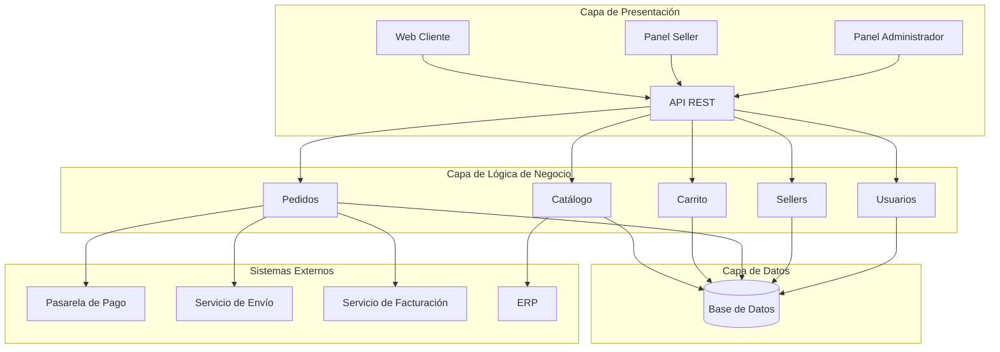

# Arquitectura Inicial

## Ejercicio 09: Diseñar la arquitectura en capas

### Objetivo
Organizar los módulos identificados anteriormente dentro de una primera propuesta de arquitectura, utilizando una **arquitectura de tres capas**.

---

## Arquitectura de tres capas

```
┌────────────────────────────────────┐
│         PRESENTACIÓN               │
│      Web / API / Interfaz          │
└─────────────────┬──────────────────┘
                  ↓
┌────────────────────────────────────┐
│      LÓGICA DE NEGOCIO             │
│                                    │
│  Catálogo                          │
│  Carrito                           │
│  Pedidos                           │
│  Sellers                           │
│  Usuarios                          │
└─────────────────┬──────────────────┘
                  ↓
┌────────────────────────────────────┐
│            DATOS                   │
│         Base de datos              │
└────────────────────────────────────┘
```

---

## Preguntas que responde cada capa

| Capa | Pregunta que responde |
|------|-----------------------|
| Presentación | ¿Cómo interactúa el usuario? |
| Lógica de negocio | ¿Qué hace el sistema? |
| Datos | ¿Dónde se almacena la información? |

---

## Responsabilidades por capa

### 1. Capa de Presentación
- Mostrar la interfaz web al cliente, seller y administrador.
- Exponer la **API REST** consumida por el frontend.
- Gestionar la autenticación inicial y el enrutamiento de las solicitudes.
- Validar datos de entrada antes de enviarlos a la capa de negocio.

### 2. Capa de Lógica de Negocio
- Implementar las reglas del marketplace.
- Coordinar los módulos de **Catálogo, Carrito, Pedidos, Sellers y Usuarios**.
- Orquestar la comunicación con sistemas externos (pago, envío, facturación, ERP).
- Aplicar validaciones de negocio y control de permisos.

### 3. Capa de Datos
- Almacenar y recuperar la información del sistema.
- Gestionar la persistencia de usuarios, productos, pedidos y sellers.
- Proveer acceso a la base de datos a través de repositorios.

---

## Módulos por capa

| Capa | Módulos |
|------|---------|
| Presentación | Web App (cliente), Panel del Seller, Panel del Administrador, API REST |
| Lógica de negocio | Catálogo, Carrito, Pedidos, Sellers, Usuarios |
| Datos | Base de datos relacional, repositorios, caché (opcional) |

---

## Sistemas externos integrados

| Sistema | Capa que interactúa | Propósito |
|---------|---------------------|-----------|
| Pasarela de pago | Lógica de negocio | Procesar pagos |
| Servicio de envío | Lógica de negocio | Gestionar entregas |
| Servicio de facturación | Lógica de negocio | Generar comprobantes |
| ERP | Lógica de negocio / Datos | Proveer productos y stock |

---

## Dependencias entre capas

```
Presentación  ──►  Lógica de negocio  ──►  Datos
       │                   │
       │                   └──►  Sistemas externos
       │
       └──►  API REST (comunicación con el frontend)
```

- La capa de **Presentación** depende de la **Lógica de negocio**.
- La capa de **Lógica de negocio** depende de la capa de **Datos** y de los **sistemas externos**.
- La capa de **Datos** no depende de las capas superiores (bajo acoplamiento).

---

## Diagrama de arquitectura en Mermaid


