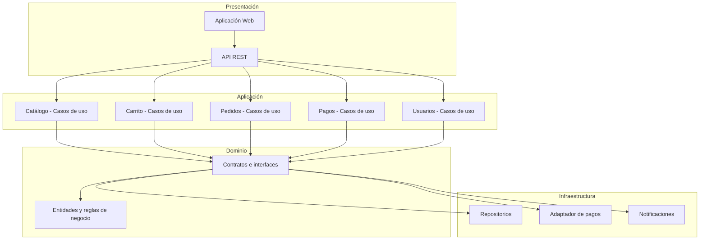

# Estilo Arquitectónico

## Objetivo

Definir el estilo arquitectónico del sistema y representar la estructura global mediante un diagrama que muestre los principales componentes y sus relaciones.

---

## Estilo seleccionado

**Monolito modular con Clean Architecture.**

El sistema se organiza como una aplicación desplegable única, pero internamente separada en módulos independientes y capas bien definidas. Esta combinación responde a los drivers arquitectónicos identificados previamente.

---

## Justificación

| Driver | Cómo lo responde el estilo |
|--------|----------------------------|
| DA01 Escalabilidad | El monolito modular permite escalamiento horizontal sin la complejidad operativa de microservicios. |
| DA02 Rendimiento | La separación por capas facilita incorporar caché y optimizar la comunicación entre módulos. |
| DA06 Mantenibilidad | Clean Architecture aísla las reglas de negocio de los detalles tecnológicos, permitiendo cambios sin afectar otros módulos. |

---

## Capas del sistema

| Capa | Responsabilidad |
|------|-----------------|
| Presentación | Interfaz web y API REST que expone los servicios al frontend. |
| Aplicación | Casos de uso que orquestan las operaciones del sistema. |
| Dominio | Entidades, reglas de negocio y contratos (interfaces) del sistema. |
| Infraestructura | Implementaciones concretas de repositorios, adaptadores de pago y notificaciones. |

---

## Módulos del sistema

| Módulo | Responsabilidad |
|--------|-----------------|
| Catálogo | Consulta y gestión de productos disponibles. |
| Carrito | Administración del carrito de compras del usuario. |
| Pedidos | Registro y seguimiento de pedidos realizados. |
| Pagos | Integración con la pasarela de pagos y confirmación de operaciones. |
| Usuarios | Registro, autenticación y gestión de cuentas. |

---

## Relación entre capas y módulos

---

## Diagrama de estructura global

---

## Beneficios del estilo elegido

- **Modularidad.** Cada módulo puede evolucionar de forma independiente.
- **Bajo acoplamiento.** Las capas se comunican mediante contratos, no implementaciones.
- **Facilidad de pruebas.** El dominio puede probarse sin depender de frameworks ni servicios externos.
- **Preparado para escalar.** Si el sistema crece, los módulos pueden separarse en servicios sin reescribir la lógica de negocio.