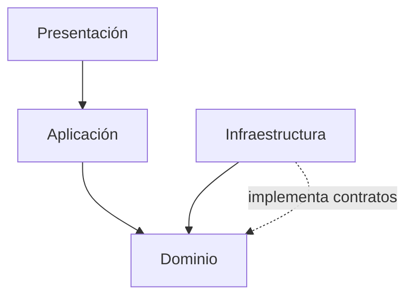
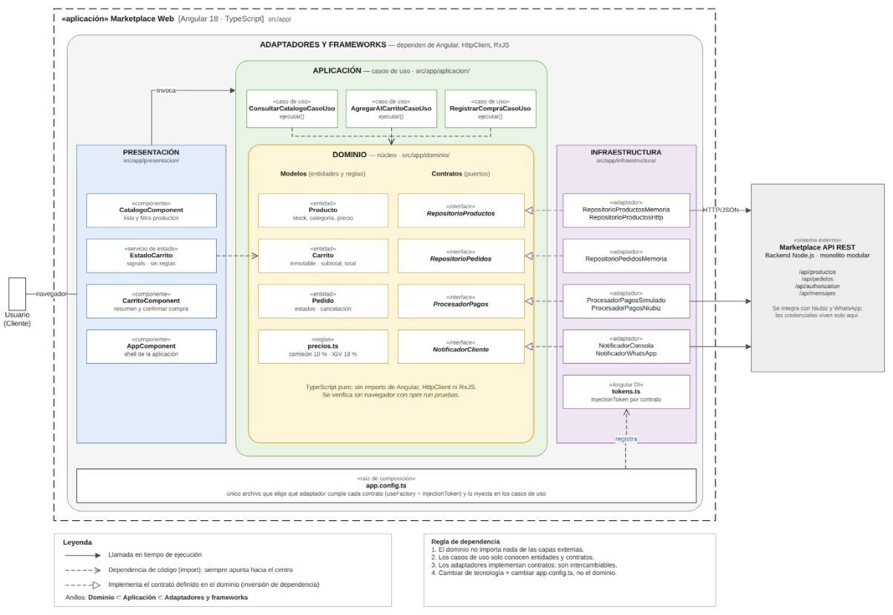

# Enfoque Arquitectónico

## Objetivo

Definir el patrón o enfoque arquitectónico que guía la organización interna del sistema y el manejo de las dependencias entre sus componentes.

---

## Patrón seleccionado

**Clean Architecture (Arquitectura Limpia).**

---

## Descripción aplicada al Marketplace

| Elemento | Descripción aplicada al Marketplace |
|----------|-------------------------------------|
| Patrón / enfoque arquitectónico | Clean Architecture (Arquitectura Limpia). |
| Objetivo | Separar responsabilidades y controlar las dependencias hacia el dominio. |
| ¿Qué problema resuelve? | Evita el acoplamiento entre la interfaz Angular, las reglas del negocio y las tecnologías externas, como bases de datos, API y servicios de pago. |
| Capas definidas | Presentación, Aplicación, Dominio e Infraestructura. |
| Beneficios | Facilita el mantenimiento y las pruebas unitarias. Permite cambiar implementaciones técnicas sin modificar innecesariamente las reglas del negocio. Mejora la organización y separación de responsabilidades del código. |

---

## Regla de dependencias

Las dependencias internas siempre apuntan hacia el dominio. Es decir:

- La capa de **Presentación** depende de **Aplicación**.
- La capa de **Aplicación** depende de **Dominio**.
- La capa de **Infraestructura** implementa los contratos definidos en **Dominio**, pero no al revés.
- El **Dominio** no depende de ninguna otra capa.

Esto garantiza que las reglas del negocio permanezcan aisladas de los detalles tecnológicos.

---

## Capas y responsabilidades

| Capa | Responsabilidad |
|------|-----------------|
| Presentación | Interfaz Angular y API REST. Se encarga de la interacción con el usuario y la comunicación con el backend. |
| Aplicación | Casos de uso que orquestan las operaciones del sistema. |
| Dominio | Entidades, reglas de negocio y contratos (interfaces) del sistema. |
| Infraestructura | Implementaciones concretas de repositorios, adaptadores de pago y notificaciones. |

---

## Flujo de dependencias

---

## Diagrama del enfoque arquitectónico

